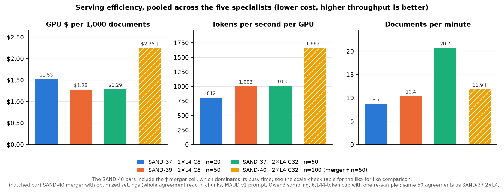
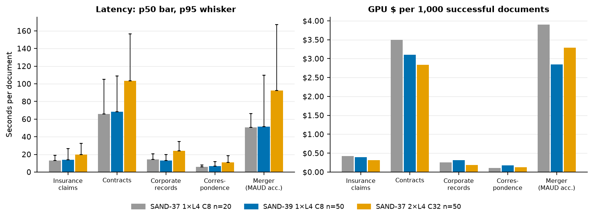
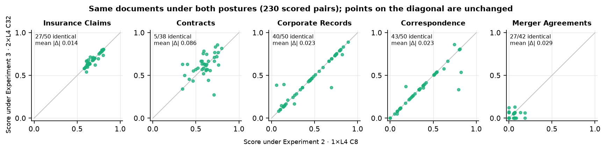
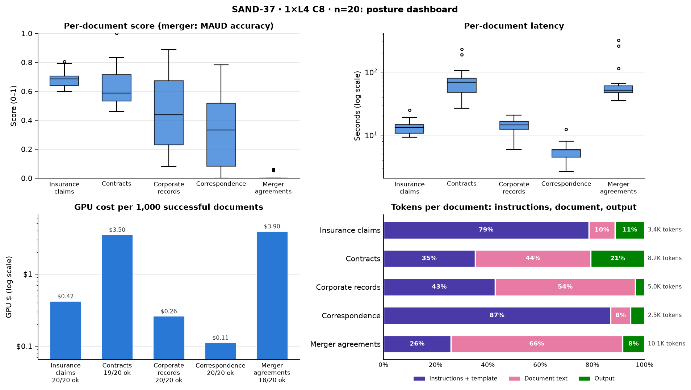
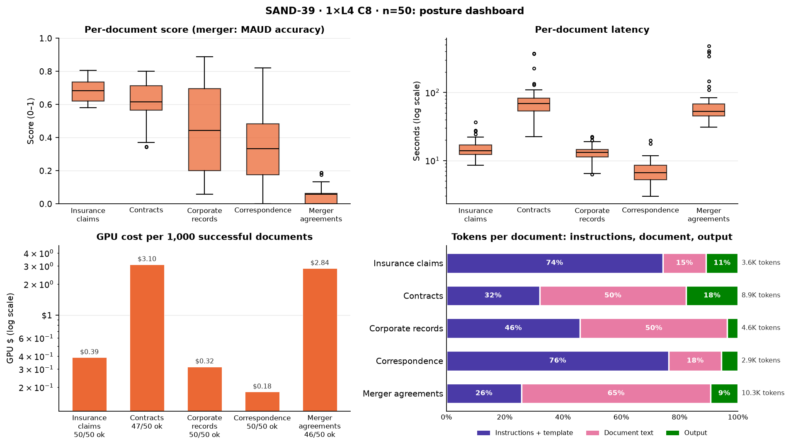
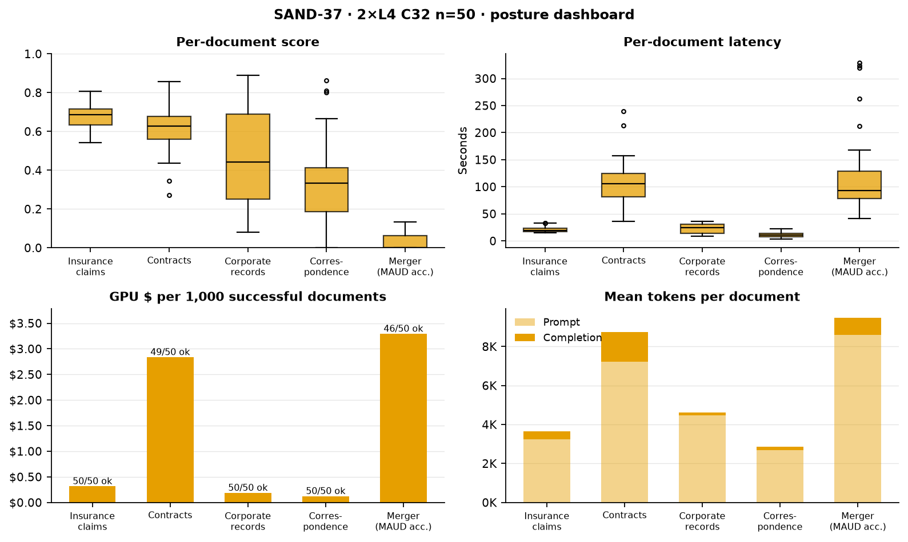

# SAND-37 / SAND-39 Specialist Grid: Results and Cost Summary

**Model:** Qwen/Qwen3-8B-AWQ on vLLM v0.29.0 · **GPU:** NVIDIA L4 at $0.80 per GPU-hour  
**Data:** public `Lucius-Morningstar/mailroom-dataset` ground_truth @ `ed7576b6`, seed 42; the n = 20 draw is nested in the n = 50 draw, and every n = 50 posture scores the identical documents.  
**Engine (SAND-37 / SAND-39):** AWQ-Marlin, fp8 KV cache, CUDA graphs, prefix caching, thinking disabled, 8,192-token output cap, frozen v1 prompts; temperature 0.7 for contracts and merger, 0.1 otherwise.  
**SAND-40:** 2×L4 at C32. Short classes keep that engine at n=100 (the n=50 draw nested inside). Contracts and merger redeploy onto a 65,536-token YaRN window; merger uses the optimized settings marked †.

| Study | Posture | GPUs | Client concurrency | Documents per class | Status |
| --- | --- | ---: | ---: | ---: | --- |
| SAND-37 | 1×L4 C8 n=20 | 1 | 8 | 20 | 5 of 5 cells |
| SAND-39 | 1×L4 C8 n=50 | 1 | 8 | 50 | 5 of 5 cells |
| SAND-37 | 2×L4 C32 n=50 | 2 | 32 | 50 | 5 of 5 cells |
| SAND-40 | 2×L4 C32 n=100 | 2 | 32 | 100 (merger 50) | pending |

## Serving efficiency (pooled across the five specialists)

| Metric | SAND-37 1×L4 C8 n=20 | SAND-39 1×L4 C8 n=50 | SAND-37 2×L4 C32 n=50 | SAND-40 2×L4 C32 n=100 |
| --- | ---: | ---: | ---: | ---: |
| Documents ok / total | 97 / 100 | 243 / 250 | 245 / 250 | pending |
| Error rate | 3.0% | 2.8% | 2.0% | pending |
| Throughput (documents per minute) | 8.74 | 10.40 | 20.71 | pending |
| Throughput (tokens per second per GPU) | 812 | 1,002 | 1,013 | pending |
| GPU cost per document | $0.00153 | $0.00128 | $0.00129 | pending |
| GPU cost per 1M tokens | $0.274 | $0.222 | $0.219 | pending |
| Busy-window GPU cost | $0.153 | $0.321 | $0.322 | pending |

## Quality and cost by specialist

Columns within each cell follow the posture order above (1×L4 C8 n=20 · 1×L4 C8 n=50 · 2×L4 C32 n=50 · 2×L4 C32 n=100).

| Specialist | Metric | Score | ok / n | p50 latency (s) | $ per ok document |
| --- | --- | :---: | :---: | :---: | :---: |
| Insurance Claims | Field score | 0.684 · 0.684 · 0.686 · pending | 20/20 · 50/50 · 50/50 · pending | 13.2 · 14.0 · 19.6 · pending | 0.00042 · 0.00039 · 0.00032 · pending |
| Contracts | Field score (CUAD F1) | 0.631 (0.597) · 0.602 (0.590) · 0.615 (0.605) · pending | 19/20 · 47/50 · 49/50 · pending | 65.8 · 68.2 · 103.3 · pending | 0.00350 · 0.00310 · 0.00284 · pending |
| Corporate Records | Field score | 0.459 · 0.449 · 0.452 · pending | 20/20 · 50/50 · 50/50 · pending | 14.4 · 13.2 · 24.1 · pending | 0.00026 · 0.00032 · 0.00019 · pending |
| Correspondence | Field score | 0.327 · 0.345 · 0.334 · pending | 20/20 · 50/50 · 50/50 · pending | 5.8 · 6.6 · 10.7 · pending | 0.00011 · 0.00018 · 0.00012 · pending |
| Merger Agreements | MAUD accuracy (coverage) | 0.014 (13%) · 0.048 (24%) · 0.035 (23%) · pending† | 18/20 · 46/50 · 46/50 · pending | 50.5 · 51.3 · 92.5 · pending | 0.00390 · 0.00284 · 0.00329 · pending |

Field scores are the mean suite extraction score against ground truth; contracts adds CUAD clause scoring. Merger is scored by micro-accuracy over labeled MAUD questions, a different scale from the field scores.

† optimized merger settings: 64K YaRN window, Qwen3 sampling (temperature 0.7, top_p 0.8, top_k 20, presence_penalty 1.0), chunked whole-document extraction, 6,144-token output cap, one length re-sample, and the MAUD v1 prompt. The merger cell stays at n=50, the same agreements as SAND-37 2×L4.

## Findings

1. **Scaling out to 2×L4 at C32 raises throughput by +99% at unchanged cost per document** (identical 250 documents, SAND-39 1×L4 C8 n=50 vs SAND-37 2×L4 C32 n=50). Moving from 1×L4 C8 n=50 to 2×L4 C32 n=50 changes cost per document by +0%, tokens per second per GPU by +1%, and pooled documents per minute by +99%, so capacity scales near-linearly with GPU count. Median per-document latency rises by a factor of 1.4–1.8×, reflecting per-replica queueing at the higher concurrency.
2. **Extraction quality is independent of serving posture.** Field scores differ by at most 0.029 across postures; CUAD F1 differs by 0.015, consistent with sampling variation rather than any change in model output.
3. **All 15 errors are output-cap truncations: the model reached the 8,192-token limit before closing the JSON** (contracts 1/20, 3/50, 1/50; merger agreements 2/20, 4/50, 4/50). No errors arose from infrastructure, authentication or JSON parsing.
4. **Merger agreements are the principal quality gap.** Source agreements far exceed the 30,000-character input window (head plus tail), so the model answers only 13%–24% of labeled MAUD questions, with 10%–20% precision on those answered. Closing the gap requires an input strategy such as chunked or retrieval-based clause extraction, not a change of serving posture.
5. **Correspondence field scores are low and dispersed** (mean 0.33–0.34, standard deviation 0.20–0.24). Stability across postures points to prompt or scorer alignment rather than serving; it is the next candidate for review.
6. **Schema conformance is incomplete for insurance claims** (schema-valid rate 0.20–0.30; corporate records 0.94–0.95; 1.00 for contracts, merger and correspondence). Its content scores well, but strict-schema consumers would reject most outputs; grammar-constrained decoding, as already used for contracts and merger, is the direct remedy.

## Figures: posture comparison

*Figure 1. Pooled serving efficiency by posture: GPU cost per 1,000 documents, tokens per second per GPU, and documents per minute.*

*Figure 2. Primary quality metric by specialist and posture; labels mark failed documents. Merger is MAUD accuracy, a different scale from the field scores.*

*Figure 3. Per-document latency (bar p50, whisker p95) and GPU cost per 1,000 successful documents, by specialist and posture.*

*Figure 4. Matched-sample check: each point is one document scored under SAND-39 (1×L4 C8) and SAND-37 (2×L4 C32). Points on the diagonal mean the posture did not change the output's score.*

## Cost accounting and run integrity

- **SAND-37 1×L4 C8 n=20:** busy-window GPU $0.15 across 100 documents.
- **SAND-39 1×L4 C8 n=50:** busy-window GPU $0.32 across 250 documents.
- **SAND-37 2×L4 C32 n=50:** busy-window GPU $0.32 across 250 documents.
- **SAND-37 metered Modal total:** $1.09 ($0.00 billed after credits). Covers both SAND-37 postures plus cold boots, pinned-warm idle between cells, the weight pre-warm, and one invalidated contracts attempt (client credential-precedence defect, SAND-038; excluded and rerun).
- **SAND-39 metered Modal total:** $0.49 ($0.00 billed after credits). One 1×L4 session: weight pre-warm, cold boot, the five cells pinned warm, and teardown. October month-to-date metering ($1.42) less the SAND-37 October hours ($0.93).
- **Teardown** is verified after each posture, with zero containers left warm.
- **Comparability:** SAND-39 and the SAND-37 2×L4 leg score identical n = 50 documents and differ only in GPU count and client concurrency; the SAND-37 1×L4 leg is a nested n = 20 subset.

**Source data:** per-cell score and cost cards, run reports and vLLM serving telemetry under `1L4/<specialist>/` and `2L4/<specialist>/`; posture suite cards `1L4/L4x1-SCORE-COST-CARD.md` and `2L4/L4x2-SCORE-COST-CARD.md`. Regenerate with `sandbox run card --master`.

## Appendix: posture dashboards

*Dashboard 1. SAND-37 1×L4 C8 n=20: per-document score and latency distributions, cost per 1,000 successful documents, and token mix by specialist.*

*Dashboard 2. SAND-39 1×L4 C8 n=50: per-document score and latency distributions, cost per 1,000 successful documents, and token mix by specialist.*

*Dashboard 3. SAND-37 2×L4 C32 n=50: per-document score and latency distributions, cost per 1,000 successful documents, and token mix by specialist.*
